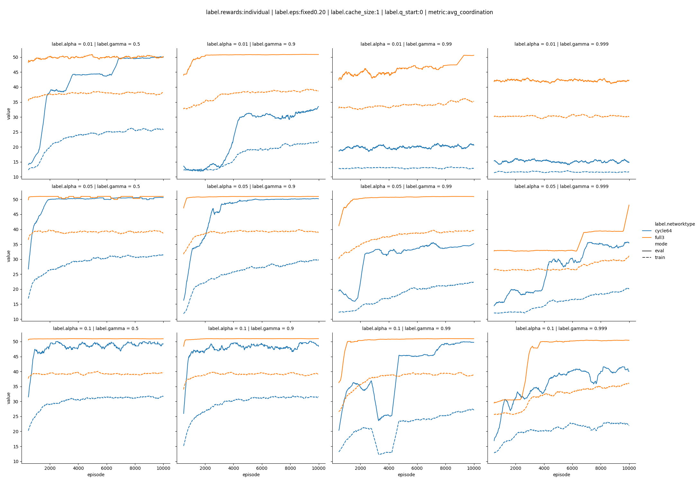
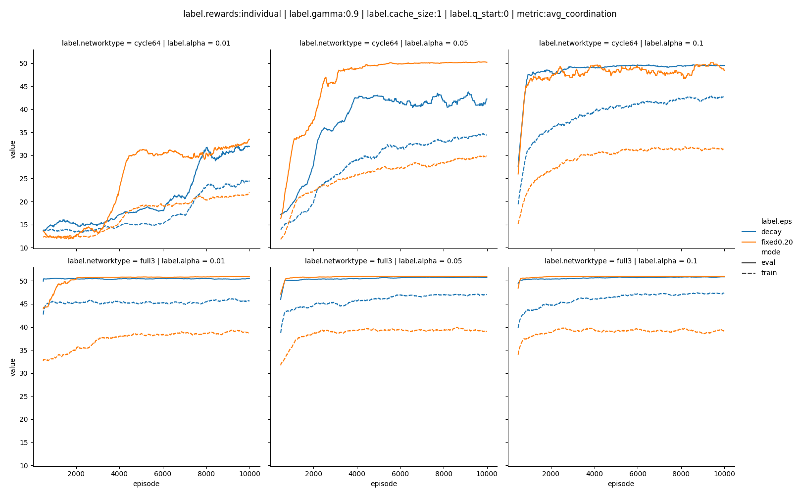
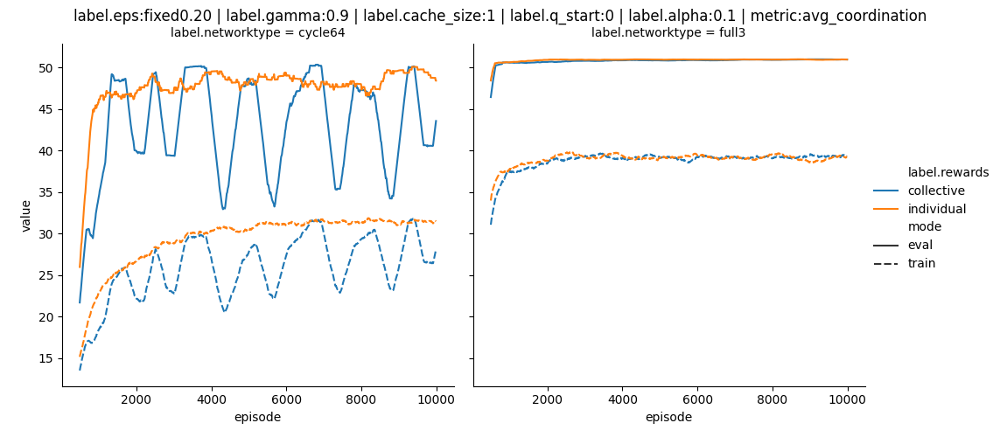
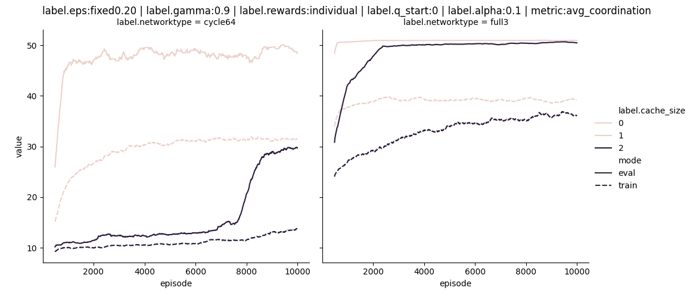

# Tabular only

## gamma, alpha, networktype

The network type (and number of agents) has a huge impact on the complexity of the task and hence on the learning rate.

The parameter gamma controlles how much the model anticipates future rewards. The learning rate, alpha, controlles how much the model changes its weights in each iteration. 

The higher the gamma, the harder for the model to learn. A higher learning rate can compensate for that partically. 

Low gamma and low alpha lead to more stable learning curves. 

## e-greedy, alpha, networktype

Here we compare different epsilon-greedy learning strategies. One with a fixed 20% chance of taking a random action. A second one with starts with 20% and then quickly (within 100 episodes) reduces to 5%. 

We see (unsurprisingly) large differences in the training performances between the two approaches. Interstingly there is not so much of a difference in the evaluation performance. 

When changing the learning strategy it is therefore important to always compare on the base of the evaluation performance.

## Collective rewards

In this specific setting individual rewards are converging faster. Also collective rewards more tend towards oscillating behaviour.

## Collective rewards

The cache size determine how many actions of each neighbor the agent sees (cachesize = 1: only the last action, cachesize = 2: the last and the one before).

In this task a larger cachesize (and hence much larger observation space), leads to a slower learning and ulimately lower performance. However as there is no adversial player, a larger cachesize is not needed.

# To Read

https://www.researchgate.net/post/How_to_make_the_multiagent_Q_learning_table_when_the_agents_are_non_cooperative_in_nature_that_is_the_two_agents_have_the_opposite_goals