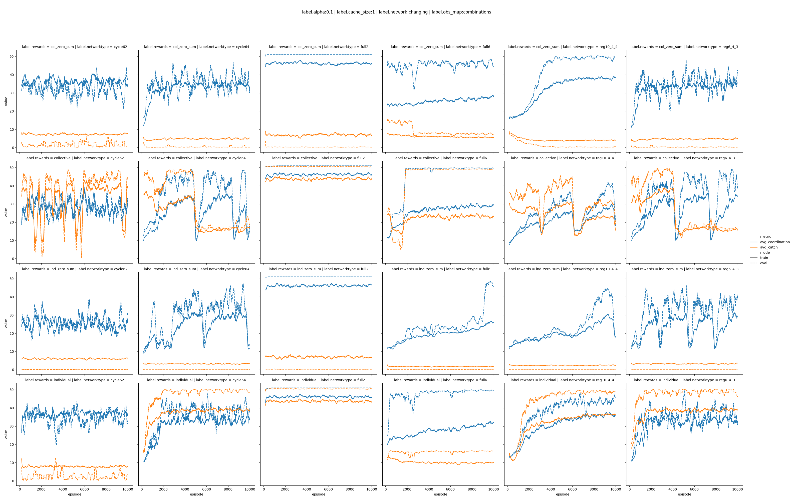
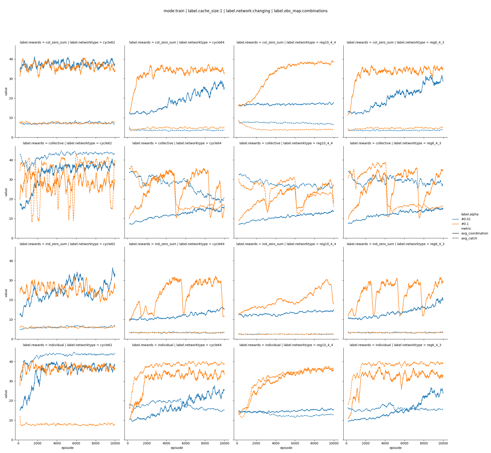

# Tabular only

## gamma, alpha, networktype

The network type (and number of agents) has a huge impact on the complexity of the task and hence on the learning rate.

The parameter gamma controlles how much the model anticipates future rewards. The learning rate, alpha, controlles how much the model changes its weights in each iteration. 

The higher the gamma, the harder for the model to learn. A higher learning rate can compensate for that partically. 

Low gamma and low alpha lead to more stable learning curves. 

## e-greedy, alpha, networktype

Here we compare different epsilon-greedy learning strategies. One with a fixed 20% chance of taking a random action. A second one with starts with 20% and then quickly (within 100 episodes) reduces to 5%. 

We see (unsurprisingly) large differences in the training performances between the two approaches. Interstingly there is not so much of a difference in the evaluation performance. 

When changing the learning strategy it is therefore important to always compare on the base of the evaluation performance.

## Collective rewards

In this specific setting individual rewards are converging faster. Also collective rewards more tend towards oscillating behaviour.

## Collective rewards

The cache size determine how many actions of each neighbor the agent sees (cachesize = 1: only the last action, cachesize = 2: the last and the one before).

In this task a larger cachesize (and hence much larger observation space), leads to a slower learning and ulimately lower performance. However as there is no adversial player, a larger cachesize is not needed.

## Tabular vs heuristic

### Network topology

The network topology has a massive influence on the learning dynamic. Fully connected networks do (in general) show little improvement over time. In particular networks with lower density appear more interesting. 

### Alpha

The learning rate, alpha, is an important parameter. Good alpha depend usualy on the other parameter of the network, for this reason it makes sense to routinely scan a couple of different alpha values.

### Network Position

Here we investigate the impact of fixing (or not) the position of each agent in the network. In general the impact of this parameter is rather low. In order to aviod unexpected effects we suggest to keep this parameter

### Mapping of agents observations

When mapping the observations to individual q values, one can either distinguish different agents or not i.e. the order of neighbors can be taken into account or not. In the "combinations" case, where the order is not considered, there are less distinguished observations and hence the q table is smaller. Correspondingly in most cases agents learn faster. In general the difference is relatively small.

### Cache Size

When playing against a heuristic a larger cache is not beneficial, but instead leads to a slower learning.

# To Read

https://www.researchgate.net/post/How_to_make_the_multiagent_Q_learning_table_when_the_agents_are_non_cooperative_in_nature_that_is_the_two_agents_have_the_opposite_goals