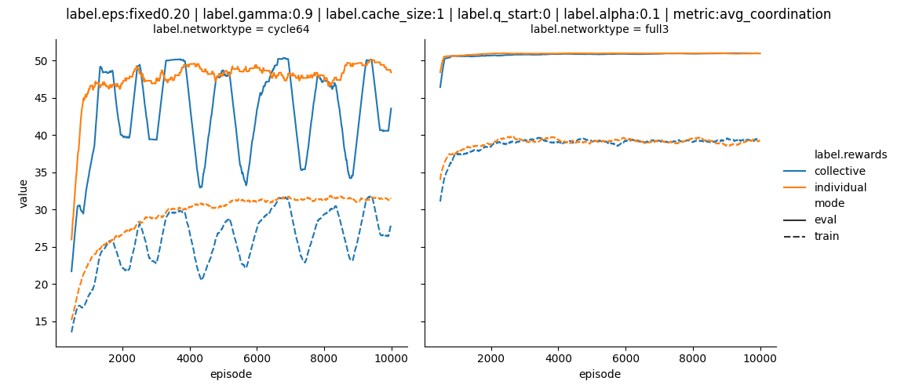

# TabularQ learning 

Setting: 
CI is trying to coordinate in a network. Each agent has as an input its own color and the colors of all neighbors.

## Under which conditions are the agents coordinating?

## gamma, alpha, network are relevant parameter

Agents are coordinating. But, gamma, alpha, network topology have huge impact. 

Large gamma hinders to learn coordination. 

Large alpha can lead to instablities.

## Further parameters are not so relevant

epsilon - not so sensitive
cache size (agents see not only the last time step, but also the one before) - much larger state space - more time for convergence, but similar performance

## Agents coordinate no matter if rewarded collectively or individually

In this specific setting individual rewards are converging faster. Also collective rewards more tend towards oscillating behaviour.

# TabularQ CI against adversial heuristic

Here we add a AI heuristic, which simply predicts that each CI agent will stick to its last action. 

## Alpha needs to be tuned to the setting

Here we see:
* different reward functions
* different networks
* different alpha (color!)

Sometimes a larger alpha is leading to ozillations.
Sometimes a smaller alpha does not allow for any learning.

## No (interesting) further insights

* network topology has massive impact
* shuffling agents positions and resampling network after each episode has not so big impact
* considering (or not) neihbors position when mapping neighbors to q table, does not have a big impact neither
* adding history makes learning much slower, but no qualitative difference

# TabularQ CI against adversial TabularQ AI

Same algorithm for CI and AI. CI and AI in principal make the same observations. So better to talk about two different tasks:
- coordination
- predicition

Both task could be done by a CI (as in shared q table) and/or AI (no shared q table). **But naming AI and CI will refere to the tasks coordination and prediction, respectivly. SORRY :-)**

## Agents benefit from sharing the QTable

All agents use the same QTable. If two agents act on exactly the same observation then (randomly) only one of the two updates the table (edge case).

In the general sum case, the AI seems to quickly predict the CIs actions. Over episodes the CI is linearly improving their coordination. For the CI a shared Q table is beneficially. The performance of the AI seems to be mainly governed by the CI, so the AI just mirrors the CI performance.

## Degree and chromatic number matters, number of agents not so much.

Different network topologies lead to qualitively very different results. That makes it currently difficult to generalize results. The number of agents however does qualitatively not impact the result a lot.

## Results are to be taken with grain of salt

In this plot there are episodes in which only the ai and others where only the ci is learning. 

Surprisingly the AI is not improving performance, even in periods when the CI is not learning. **BUG anywhere?**

# Approximate Q learning

Linear q function approximation:
* one hot encoding of inputs
* flat one linear regression

RNN: 
* one hot encoding of inputs
* one layer RNN (simple Elman RNN), tanh activations

# Next steps

* define simple reference cases, with clear expected outcomes
    * e.g. a Q table should be able to predict the actions of an other Q table
    * if the mapping is identical a q table and a linear q function should be equivalent
    * ...
    * possible: include even more simple reference environment
* debug and analyse the different methods to match those expectations
