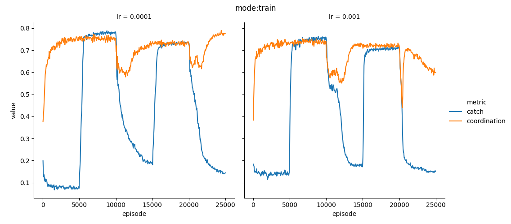
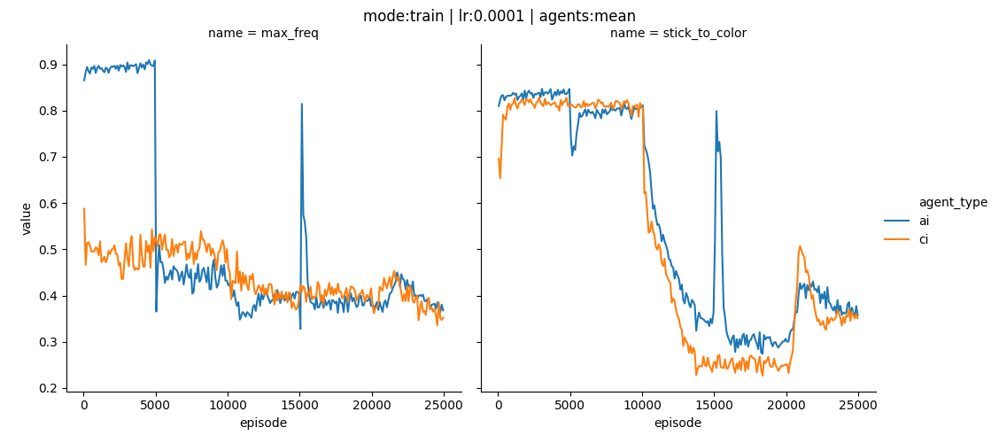
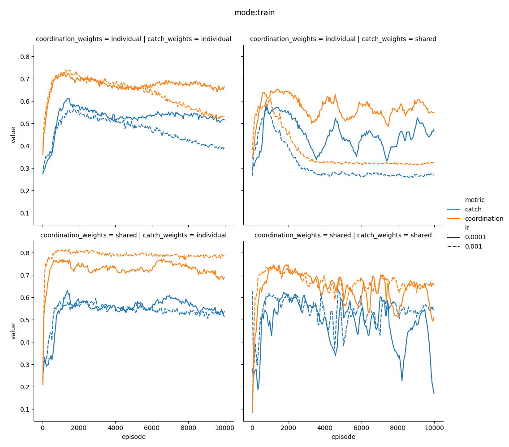
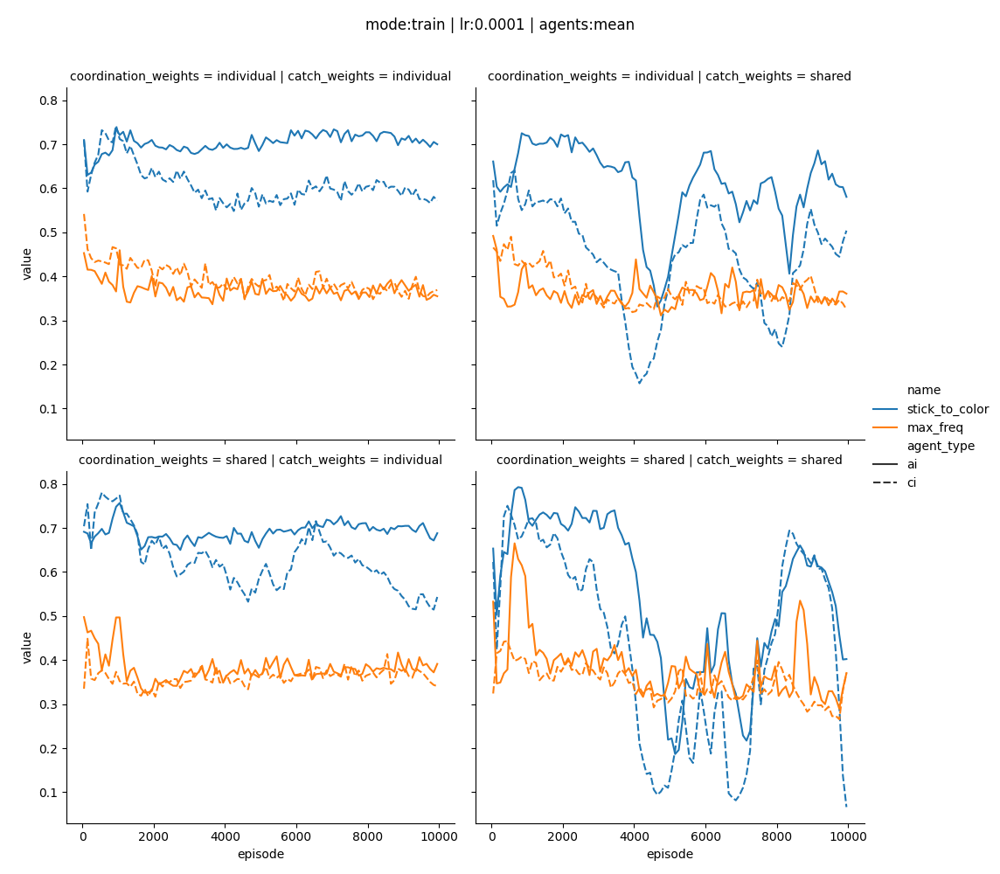
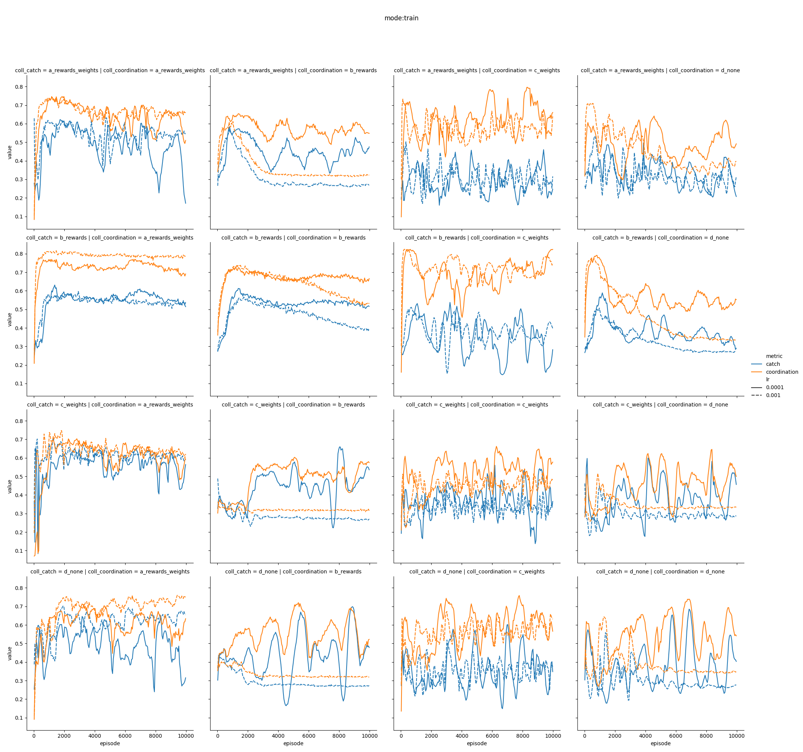
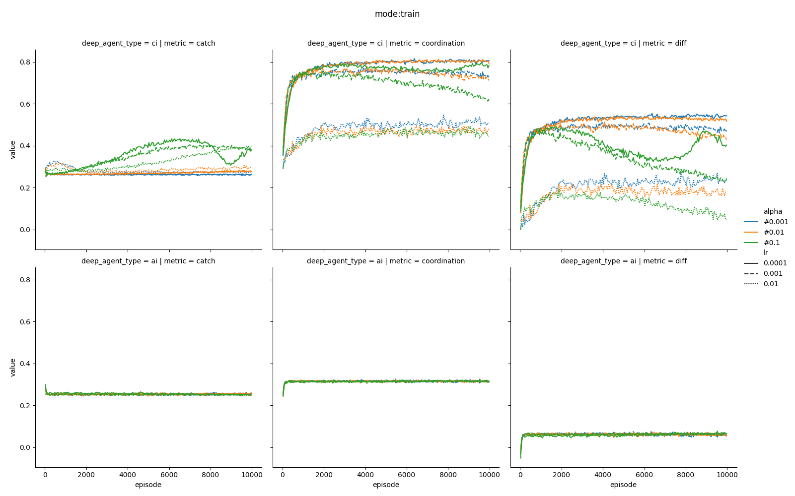

# Tabularq vs Tabluarq

## Findings

In general it is hard to find systematic relationships between different treatments and the dynamics of the system. 

## Next steps

* Investigate further the reproducability of the results.
* Implement batch learning

## Decision

But this approach on hold.

# Neural Agents

## Baseline

settings
* degree: 4
* chromatic number: 4

agents random: 
* catch: ~25%
* coordination: ~10%

## Does it works?

## Technical Settings (capazity, batch_size, update_frequency)

* model learns, irrespective of capazity, batch_size, update_frequency
* results can differ
* results appear more stable accross settings compared to tabular q learning
* models do learn also for very small batch_sizes / capazities (down to 1 episode)

## Effect of weight sharing and reward

# Tabular vs Neural

# Ongoing and next steps

* Non regular network topologies (ongoing)
    * watts strogatz, erdos renyi
    * resample to constrain the maximum degree (for padding not to explode)
    * ideas to handle variable degree on the model side
        * same then now (justed padded)
        * max, mean pooling layer
        * attention layer
* Single AI Network
    * graph convolutional network (very straightforward)
* Noisy weight sharing
    * (noisy) federated learning (google)
