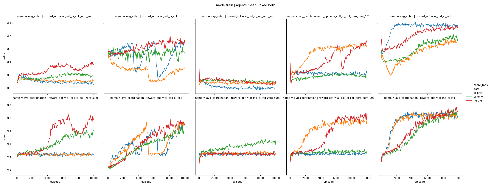
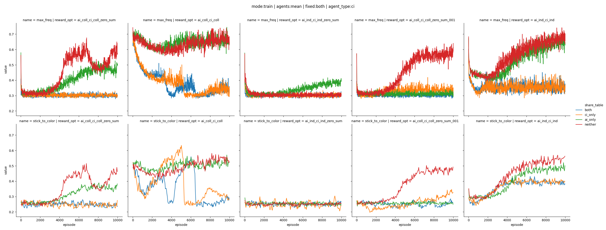
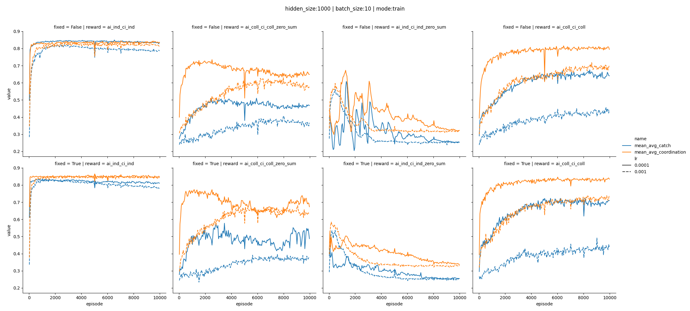
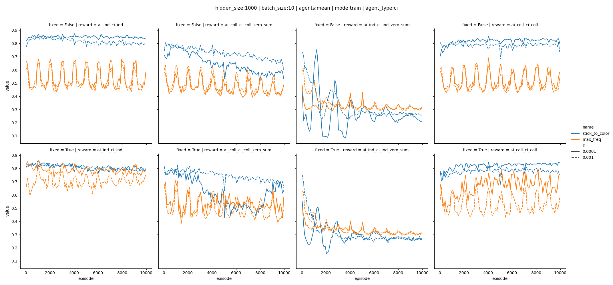
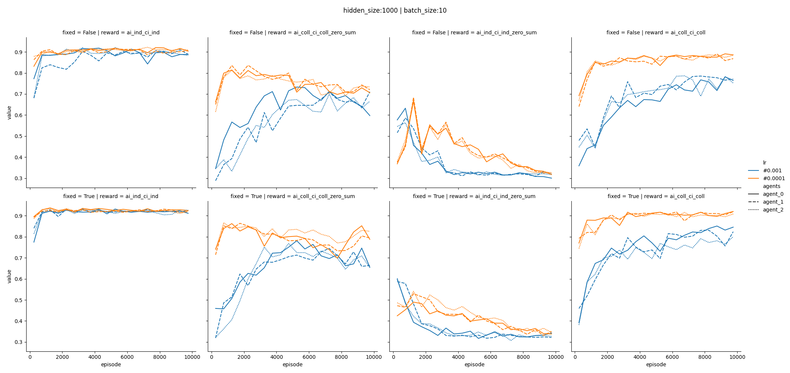

# TabularQ learning 

## the reward matters a lot

TODO: effect of randomizing network and agent position

# Approximate Q learning 

* memory replay
* batch_learning

oscillations because of target update every 1000 step?

