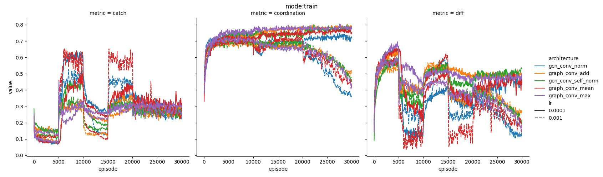
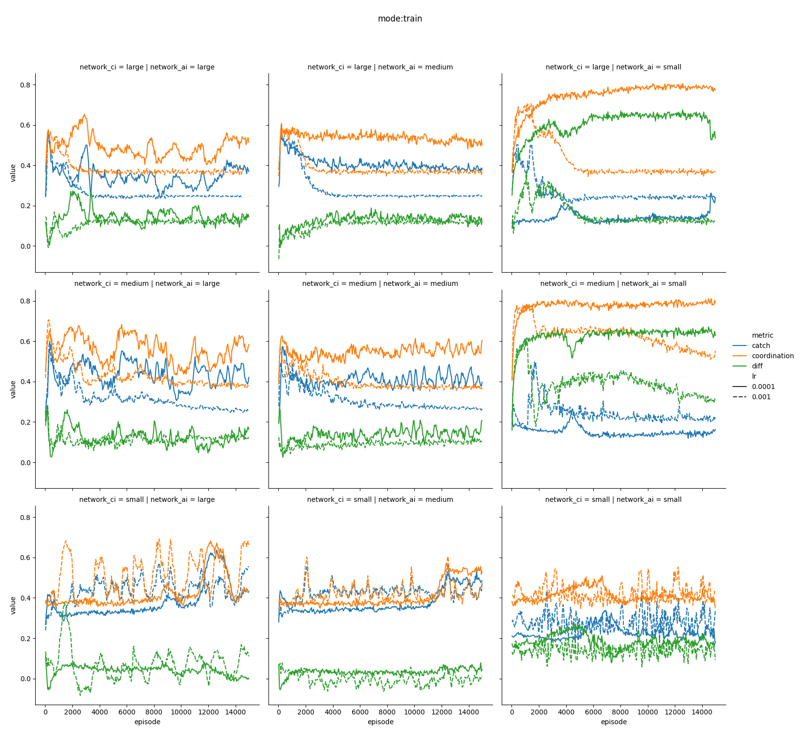
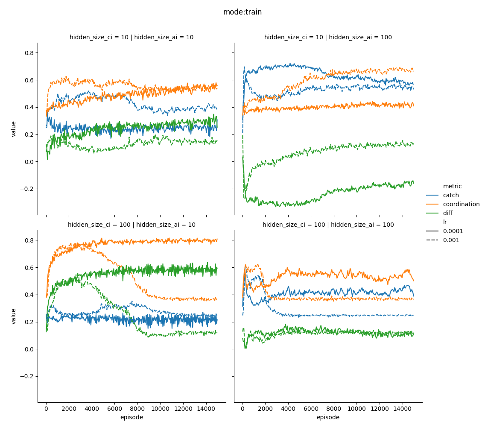
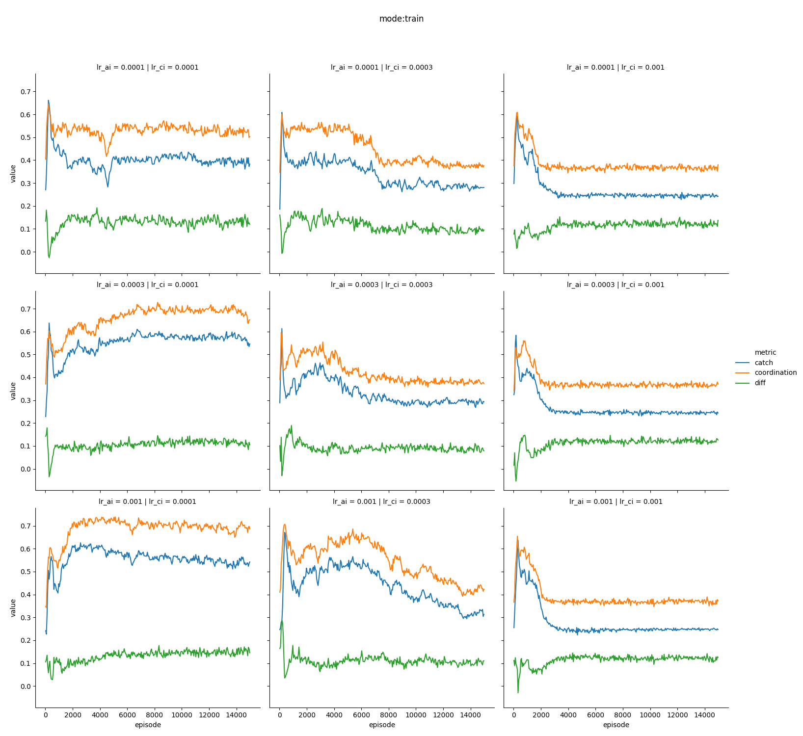
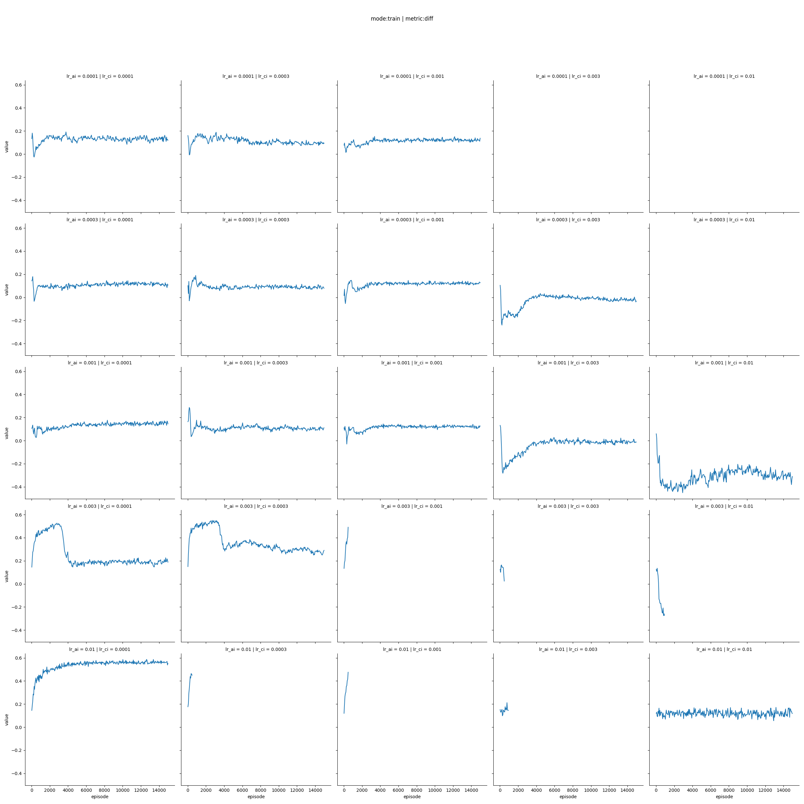
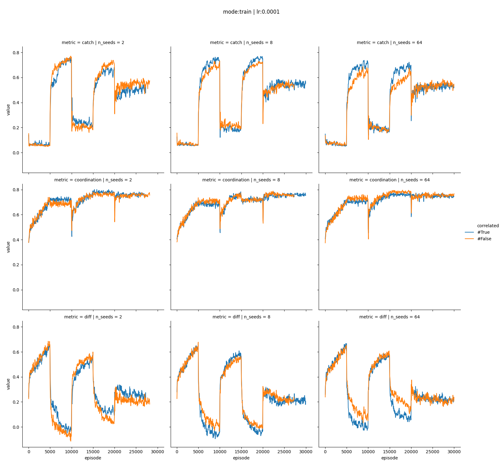

# Results

## Graph neural network

* seems to perform worse then the other architectures so far
* not really surprisingly
* expect benefits only for predicition further into the future

## CI /AI Asymmetry

### Asymmetry in layers

### Asymmetry in hidden dimensions

### Asymmetry in learning rate

## CI Secret

# Next steps

* deep dive CI secret
    * asymmetric learning rates
    * without on / off
    * code review
    * alternative architectures?
* cheap communication
    * write tests for environment
    * run on / off
* noisy weight sharing

