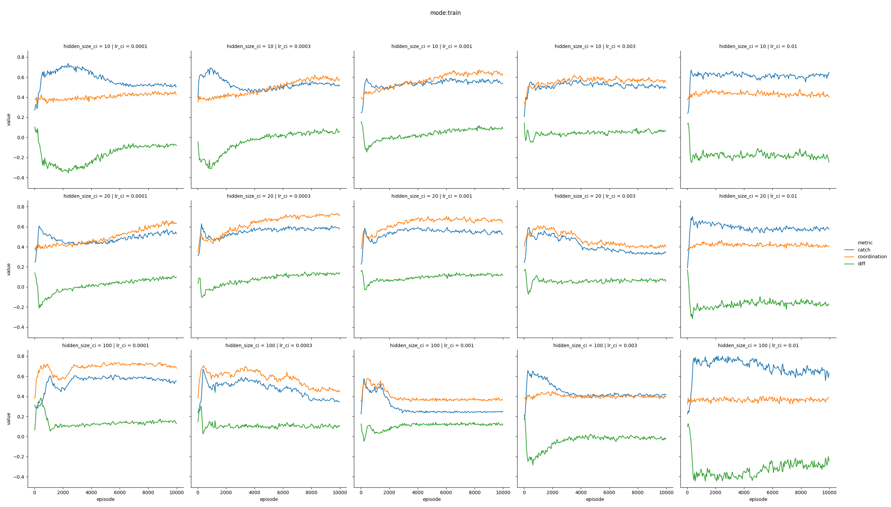

# Results

## Feedback

### avg_catch_cor, avg_catch
* adding the average coordination as input in a later layer seems to help the CI to keep being focused on coordination (avg_catch_cor)
* if only catch is added the CI focuses more on not being catched (avg_catch)
* the reward of the CI is largely uneffected by neither

### neighbor_catch, ind_catch
* adding a booling for each neighbor (and self) if being catched at the beginning of the network does help to avoid being catched (neighbor_catch)
* with this information agents manage to increasingly outperform the AI at low learning rates
* similar observations (with lower magnitude) can be made when the self catch is being added at a later layer in the network (ind_catch)

### Feedback

* currently we either give global or individual feedback
    * suggestion: local feedback, aggregated performance of neighbors

## Asymmetric Learning Rate

* when AI learns faster then CI: CI wins
* when both learn with same learning rate: CI wins mostly, but for lr=0.0003
* when CI learns to fast: AI wins
* **we do not really see that CI benefit from faster learning**

### Feedback
* wired, labels wrong?

## Asymmetric Learning Rate and hidden size

### AI
* lr: 0.001
* hidden_size: 100

## Asymmetric Reward

# Ongoing

* Seeds for mixed strategy - focus
    * new seed each round - done - effect!
    * hard coded strategy how to process the secret - doing
* Cheap Talk - on hold

# Next 

* shared weights - done - works kind of
* better understanding of behaviour
    * metrics
        * distribution of keeping color length
            * relationship with network metrics (centrality, betweeness)
        * correlation of colors in network
            * distances in network vs time delta
        * n-gram distribution
            * relative frequency of equivalent n-grams (e.g. 123 vs 321, or 122 vs 322)
            * correlation / anticorrelation accross agents
    * epsilon?

