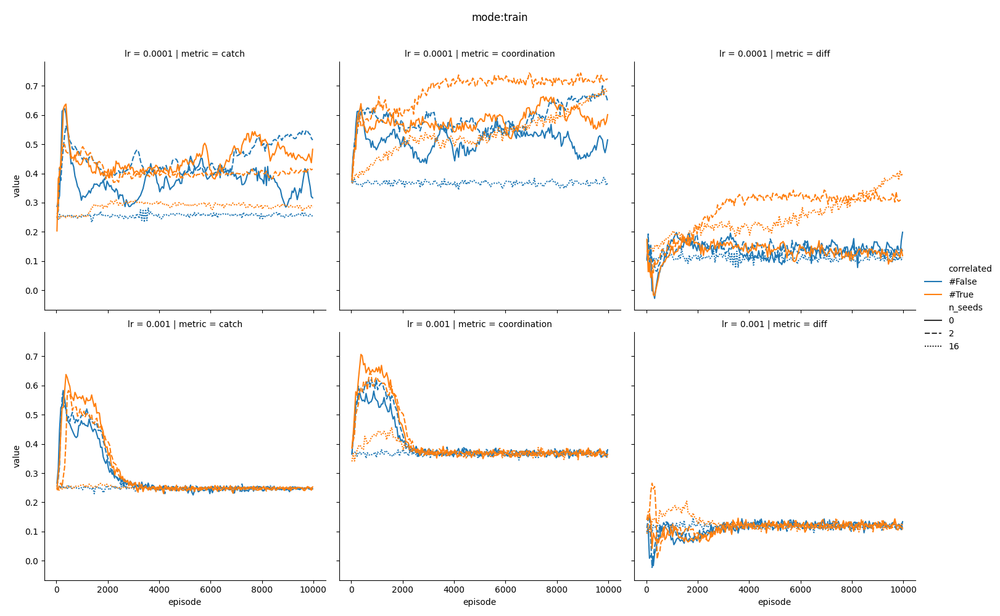
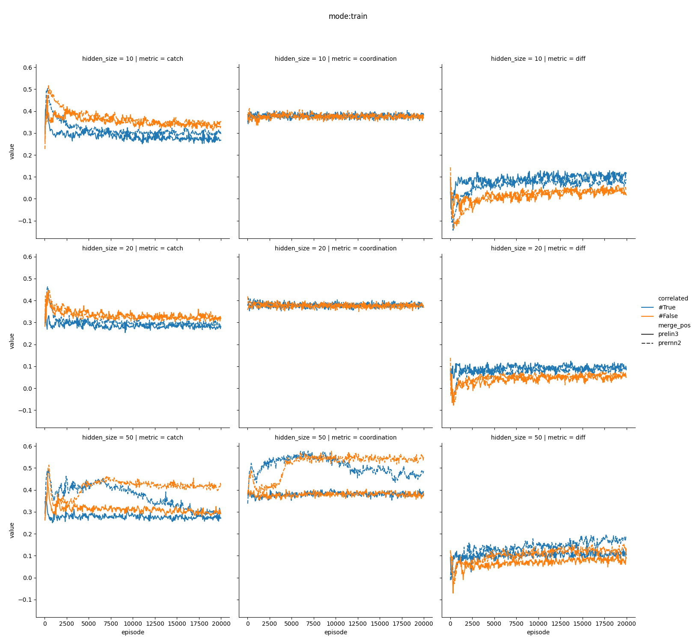
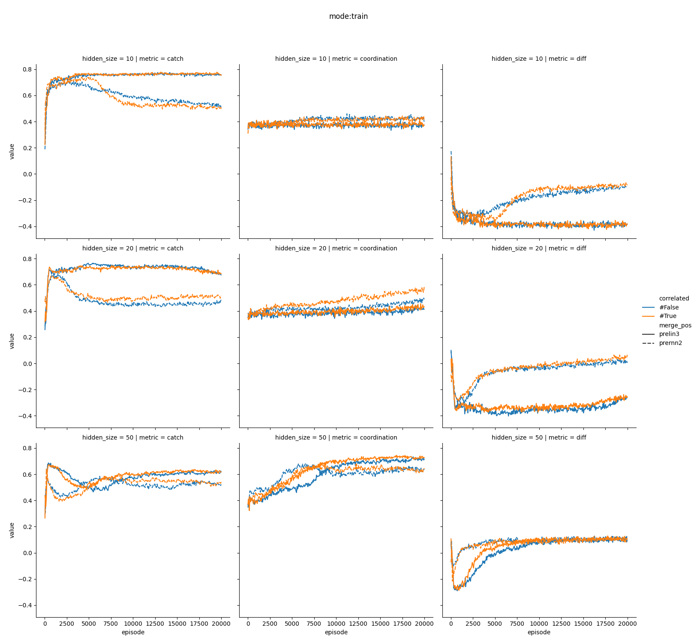
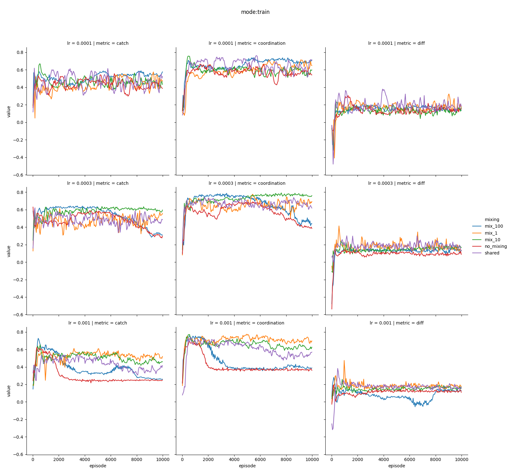

# Seed (heuristic permuations)
* new seed for each step

# Seed (learned with later layer)
* new seed for each step

* new seed for each episode

# Weight Mixing

* full mixing without noise

# Behaviour metrics
## Suggestions
* distribution of keeping color length
    * relationship with network metrics (centrality, betweeness)
* correlation of colors in network
    * distances in network vs time delta
* n-gram distribution
    * relative frequency of equivalent n-grams (e.g. 123 vs 321, or 122 vs 322)
    * correlation / anticorrelation accross agents

## To consider
* epsilon?

## Feedback
* Plots
    * Baseline: random agent
    * Add zero line to plots (e.g. random agent)
* Research question
    * Do we need a high number of codes?
        * Can the AI remember codes?
        * what about different frequencies of new codes
* metrics
    * coorelation with self vs timedelta
    * coorelation with neigbors vs timedelta
        * e.g. average coordination
    * relation to network metrics interesting
* analysis of performance over time (causalisation)